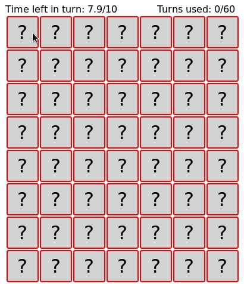
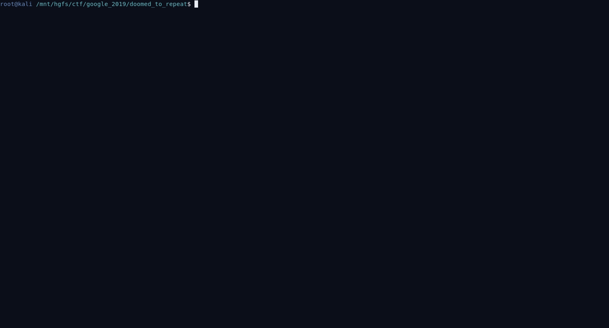

# Doomed to Repeat It

We have a classic game of memory, where you can only see one tile 
at a time. Once you unveil to identical tiles in succession, they stay up.

The goal is to find all pairs. We have the source code, but it runs on a server we don't control. We'll get a flag simply by winning the game



The caveat : there are 56 tiles and you can only use 60 moves. 


## The source code

We have the source code, so let's deep into that.


There are a lot of red herrings in comments, but the biggest red flag should be
the custom RNG. after examination, turns out there is a problem with the implementation.

### Bad RNG

This function is used to get random bits from the os in order to generate a seed.
```golang
// OsRand gets some randomness from the OS.
func OsRand() (uint64, error) {
	// 64 ought to be enough for anybody
	var res uint64
	if err := binary.Read(rand.Reader, binary.LittleEndian, &res); err != nil {
		return 0, fmt.Errorf("couldn't read random uint64: %v", err)
	}
	// Mix in some of our own pre-generated randomness in case the OS runs low.
	// See Mining Your Ps and Qs for details.
	res *= 14496946463017271296
	return res, nil
}
```
It gets a 64bit uint from the os, and then multiply it with some "pregenerated randomness"

the pre-generated randomness(https://xkcd.com/221/) is quite problematic. It is not random at all.

 * `14496946463017271296`'s prime factorisation is `2^47 * 103007`. 

*They are multiplying the os's randomness with 2^47!*

* Doing modulo multiplication on your randomness is bad.
* Doing it with a very large power of two completely breaks it.

#### An example

Let's look at one multiplication to see why this is such a problem : 

random number multiplied by 2^47:
``` 
   8979835648265197673    111110010011110110010001111000111100100001111001001100001101001
 *     140737488355328                   100000000000000000000000000000000000000000000000
 ----------------------------------------------------------------------------------------
   5491154583159832576    100110000110100100000000000000000000000000000000000000000000000
```

As we can see, this completely eliminates the 47 least significant bits of the randomly 
generated number.

Instead of having `2^64` possible seed, we now have `2^17` possible seeds (and thus `2^17` possible layouts!)  thats 131072, 
and that's totally manageable.


#### Test the theory 
This is pretty easy to test : if we patch the OsRand function and replace the 
"pregenerated randomness" with an even bigger power of two : 

```golang
func OsRand() (uint64, error) {
	// 64 ought to be enough for anybody
	var res uint64
	if err := binary.Read(rand.Reader, binary.LittleEndian, &res); err != nil {
		return 0, fmt.Errorf("couldn't read random uint64: %v", err)
	}
	// Mix in some of our own pre-generated randomness in case the OS runs low.
	// See Mining Your Ps and Qs for details.
	res *= 1 << 63 // multiplying by 2^63 should squash 63 of the random number's 64 bits
	return res, nil
}
```
With this modification, the game only ever generate one of two possible layouts. 

We're on to something!

## Boards enumeration

We already have code that takes care of taking a seed and generating a board layout out of it.
Let's keep it simple, and re-use that.  We patch the app's source code to have it dump every 
possible layouts.

A small modification to `newBoard()` and the random's library `New()` function  should do it.

This will generate all possible numbers between that have their 47 least significant
bits set to zero, and use each of them as a source of entropy for the seed to generate one
board.

```golang
func newBoard() (*board, error) {

        var b *board
        var i uint64
        var upper uint64
        upper = 1<<17   // 2 ^ 64
        for i= 1; i< upper; i++ {   // add a loop over all board
            var s uint64
            s = i << 47  // generate false_seed

            rand, err := random.New(s)   //send that false_seed in the
                                         // RNG to be used as the 'os random bits'

            if err != nil {
                    return nil, fmt.Errorf("couldn't create random: %v", err)
            }
            b = &board{
                    nums:    make([]int, BoardSize),
                    visible: make([]bool, BoardSize),
            }
            for i, _ := range b.nums {
                    b.nums[i] = i / 2
            }
            for i := BoardSize - 1; i > 0; i-- {
                    j := rand.UInt64n(uint64(i) + 1)

                    b.nums[i], b.nums[j] = b.nums[j], b.nums[i]
            }

            // and we add a print statement to dump the board do stdout
            log.Printf("[%d] %v",s, b)  // print the board!

        }
	return b, nil
}
```

We modify the New function so that it uses our specially crafted uint64 
instead of the OSrand function

```golang
func New(proto_seed uint64 ) (*Rand, error) {
	// osr, err := OsRand()
	// if err != nil {
	// 	return nil, fmt.Errorf("couldn't get OS randomness: %v", err)
	// }
	// return NewFromRawSeed(osr)
	return NewFromRawSeed(proto_seed)
}
```

With these modifications in place, running a game will print 2^17 boards to stdout. 
with a little bit of parsing, we can get them in a nice format :

```
24 3 24 18 27 26 17 9 23 7 6 0 2 11 14 8 20 5 16 19 18 5 20 19 22 21 1 10 13 8 13 0 9 2 27 14 23 12 15 16 25 12 17 7 21 22 6 15 25 1 11 4 3 26 10 4
26 20 24 9 0 18 27 15 0 24 21 1 6 27 4 5 25 20 12 3 17 7 7 22 4 2 11 11 17 23 14 8 13 10 8 19 9 14 15 10 2 18 6 21 23 19 1 16 3 26 13 12 22 16 5 25
```


A little python script will load them all in an dictionnary, with the first 4 tiles as key : 
```python

BOARD_FILE = 'boards.txt'

from collections import defaultdict


boards = defaultdict(list)
def init():
    with open(BOARD_FILE) as f:
        for line in f:
            permutation = line.strip().split(" ")
            board = [int(item) for item in permutation]
            board_key = tuple(board[:4])
            boards[board_key].append(board)


def get_all(key):
    return boards[key]
```

This gives us a simple API to query the list of boards. for instance, this will get us all
boards that have the following tiles starting top left corner `2,43,21,23`
```python
boards.init()
boards.get_all( (2,43,21,23) )
``` 

## Interracting with the game server

The game front-end interract with the game server via websockets. This was done with
the python websockets library 

some important points to note : 

    1. The websocket library used needs to understand the websocket handshake, as we
       don't want to implement the http-> websocket upgrade handshake
    2. The hostname needs to be specified or else the handshake won't be valid, and the server
       will reject the query


### Connect to the game server
This piece of (asyncio) code will connect:
```python
    async with websockets.client.connect(
            URI,
            origin='https://doomed.web.ctfcompetition.com') as ws:
        pass
```

### Play a game
These co-routines can be used to initiate the game state and send some guesses

```python
async def get_info(ws):

    qry = {"op":"info"}
    await ws.send(json.dumps(qry))
    response = await ws.recv()
    return json.loads(response)

async def send_guess(x,y, ws):

    qry = {"op":"guess",
           "body":{"x":x,
                   "y":y}}
    await ws.send(json.dumps(qry))
    response = await ws.recv()
    return json.loads(response)

```

At this point, it's just a matter of trying the first four tiles, infering the 
correct game board, and then solve a game where we know the position of all tiles!



Full python code : 

```python

#!/usr/bin/env python3


import websockets
import asyncio 
import json

URI = 'wss://doomed.web.ctfcompetition.com/ws'

import boards
boards.init()


async def send_guess(x,y, ws):

    qry = {"op":"guess",
           "body":{"x":x,
                   "y":y}}
    await ws.send(json.dumps(qry))
    response = await ws.recv()
    return json.loads(response)

async def get_info(ws):

    qry = {"op":"info"}
    await ws.send(json.dumps(qry))
    response = await ws.recv()
    return json.loads(response)


def xy_to_linear(x,y):
    return y*7 + x

def linear_to_xy(linear):
    x = linear % 7   
    y = linear // 7  
    return(x,y)

async def find_board(ws):
    board_key = [] 
    for x in range(0,4):
        response = await send_guess(x,0, ws)
        index = xy_to_linear(x,0)
        board = response['board']
        board_key.append(board[index])
        
    return tuple(board_key)


async def play():

    async with websockets.client.connect(URI,
            origin='https://doomed.web.ctfcompetition.com'
            ) as ws:

        game = await get_info(ws)

        board_key = await find_board(ws)

        print (f"Board key : {board_key}")
        valid_boards = boards.get_all(board_key)
        print ("found {} valid boards".format(len(valid_boards)))
        order = solve(valid_boards[0])
        print(valid_boards[0]) 
        print(order)

        for i in order:
            x,y = linear_to_xy(i)
            game = await send_guess(x,y, ws)
            print_board(game["board"])
            if game["message"]:
                print('\n\t' + game["message"] + '\n\n')

def print_board(board):
    print(" ".join([f'{x: >2}' for x in board] ))


def solve(board):
   
    order = []
    for item in range(0,28):
        order.extend([i for i, x in enumerate(board) if x == item])
    return order

asyncio.get_event_loop().run_until_complete(play())
```

