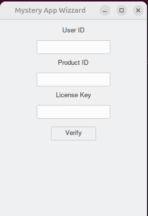

# Bad Daemon

## Challenge 1

We hare presented with an ELF file called bad_daemon

When ran, we see the following licencing screen.



Since we have none of the information, we can jump into reversing


### Reversing the App

Looking at strings, it is pretty obvious this is a pyinstaller binary. These can be easily dumped with [pyinsxtractor](https://github.com/extremecoders-re/pyinstxtractor).

This yields several files :
```
badApp.pyc                   base_library.zip
ld-linux-x86-64.so.2         libbrlapi.so.0.8
libbrotlicommon.so.1         libbrotlidec.so.1
libbz2.so.1.0                libcap.so.2
libcrypto.so.3               lib-dynload
libexpat.so.1                libffi.so.8
(...)
PYZ-00.pyz                   PYZ-00.pyz_extracted
setuptools                   struct.pyc
tcl8                         _tcl_data
_tk_data                     ttkthemes

```

Most of this comes from various libraries installed That are used by the python app. One stands out as the main file : `badApp.pyc`


This is a `pyc` file, containing only python bytecode

```
┌────────┬─────────────────────────┬─────────────────────────┬────────┬────────┐
│00000000│ cb 0d 0d 0a 00 00 00 00 ┊ 00 00 00 00 00 00 00 00 │×___0000┊00000000│
│00000010│ e3 00 00 00 00 00 00 00 ┊ 00 00 00 00 00 06 00 00 │×0000000┊00000•00│
│00000020│ 00 00 00 00 00 f3 46 01 ┊ 00 00 97 00 64 00 64 01 │00000×F•┊00×0d0d•│
│00000030│ 6c 00 6d 01 5a 01 6d 02 ┊ 5a 02 6d 03 5a 03 01 00 │l0m•Z•m•┊Z•m•Z••0│
└────────┴─────────────────────────┴─────────────────────────┴────────┴────────┘
```

As always, the first two bytes are used to identify which version of the python interpreter this PYC is for.

```python
In [1]: struct.unpack('<H', bytes.fromhex('cb0d'))
Out[1]: (3531,)
```
The cpython repo has [documentation for all of the possible values](https://github.com/python/cpython/blob/3.13/Lib/importlib/_bootstrap_external.py)
In our cases, it identifies as `Python 3.12b1 3531 (Add PEP 695 changes)`.

This is a problem, since the byte code has changed significantly post 3.11, and the tooling has not kept up to date. The traditional `uncompyle6` library doesn't work with a version that recent.

Now, this can be worked around by using the online service [pylingual](https://pylingual.io/)

We get a mock Tkinter app, that only prompts for a licence, with the following code pertaining to the licencing.

```python
@staticmethod
def validate_user_id(user_id):
  return bool(re.match('^(?=.*[a-zA-Z])(?=.*\\d)[a-zA-Z0-9]{4,10}$', user_id))

@staticmethod
def validate_product_id(product_id):
  return bool(re.match('^\\d{8}$', product_id))

@staticmethod
def generate_license_key(user_id, product_id):
  try:
    data = f'{user_id}-{product_id}'
    license_key = hashlib.sha256(data.encode()).hexdigest()[:22]
    excluded_chars = {'o', '1', '0', 'O', 'l'}
    valid_key = ''.join((c if c not in excluded_chars else 'x' for c in license_key))
    return valid_key
  except Exception as e:
    messagebox.showerror('Error', f'Error generating license key: {e}')
```


### Solution
With this, it is pretty easy to craft a valid user and product_id. Whe can then proceed to generate a valid licence key

```python
def generate_license_key(user_id, product_id):
   data = f'{user_id}-{product_id}'
   license_key = hashlib.sha256(data.encode()).hexdigest()[:22]
   excluded_chars = {'o', '1', '0', 'O', 'l'}
   valid_key = ''.join((c if c not in excluded_chars else 'x' for c in license_key))
   return valid_key

generate_license_key('a3aaa', '00000006')
```
The license key serves as the flag.


## Challenge 2

Challenge 2 starts with a very similar app. After unpacking the app as in challenge 1, we have two new things :

1. an ELF file called bad_daemon
2. a `.service` file, bad_daemon.service
3. a modified `badApp.pyc. Added to the functionality of part 1, it now also installes the ELF file as a service.


### main
```C

void main(void)

{
  SHARED_MEM *shared_mem;

  daemonize();
  openlog("bad_daemon",1,0x18);
  shared_mem = (SHARED_MEM *)setup_shared_memory();
  setup_mutex(shared_mem);
  if (shared_mem->field_show_log == 0) {
    syslog(6,
           "HINT: Keep it dynamic.\n This challenge had been tested on archlinux kernel version 6.11 .2-arch1-1 and python 3.12.6.\n Is it possible to see some delays in the syslog display. I\'ll let you figure out why.\n BTW thank you for trying my challenge, hope you\'ll like it. -mymelody1242"
          );
  }
  do {
    process_cycle(shared_mem);
    sleep(5);
  } while( true );
```
We can see in the main that the program `daemonize`, whatever that means (mostly spawning child processes), setups a shared memory object, a mutex, then starts calling `process_cycle` in a loop.

the `shared_mem` buffer gets passed along everywhere in the program


### Encryption
Down the line, deeper in that `process_cycle` method, we have the decryption of what is probably a flag :

```C
void shaboiinnk(char *flag_data,ulong len,int xor_key)

{
  char new_val;
  ulong i;

  for (i = 0; i < len; i = i + 1) {
    new_val = bing(flag_data[i],xor_key % 8);
    flag_data[i] = new_val;=
    flag_data[i] = flag_data[i] ^ (byte)xor_key;
    new_val = bong(flag_data[i],xor_key % 8);
    flag_data[i] = new_val;
  }
  bang(flag_data,len);
  return;
}

```

Now this would be pretty simple, except that `bing`, `bang` and `bong` all add some more complex bitwise operations. At this point, I wa still tempted to disregard the "keep it dynamic" tip and to do the whole thing statically.

However, because all of this decrypton happens in a rather complex dance of 5 child processes that sleep different amount of time, I decided to whip out GDB


```
// The code calling the decryption method
void process_operation(SHARED_MEM *shared_mem,int fork_count) {
  undefined4 sleep_time;

  pthread_mutex_lock(&shared_mem->mutex);
  if (fork_count == 5) {
    sleep_time = 10;
  }
  else {
    sleep_time = 0x1e;
  }
  sleep(sleep_time);
  if (shared_mem->show_unlock == 0x42) {
    syslog(5,"Flag is unlock!");
    shaboiinnk((char *)shared_mem->flag_data,0x3c,fork_count + 1);
  }
  else {
    syslog(5,"Flag is not unlock!");
  }
  msync(shared_mem,0x1000,4);
  pthread_mutex_unlock(&shared_mem->mutex);
  return;
}


Now this turned out to be a bit of a mistake, my gdb skills are not that good, and trying to wrangle it through 5 child processes did not prove fruitful. I eventually decided a different approach.

### Solution

The simpler approach was to write a small program that, in a loop, every second, would mount that shared memory and read it.

To force the decryption the first byte in the shared memory is overwritten with `0x42`. This is because, as can be seen in the `process_operation`, the `shaboiink` decryption method is only called when that value (`show_unlock` in the decompilation) is set, and nothing sets it in the program. I assume this is a guard against naive memory dumping


```C
#include <sys/mman.h>
#include <sys/stat.h>
#include <fcntl.h>
#include <stdio.h>
#include <stdlib.h>

int main(int argc, char *argv[]) {

  int HNDL_shared;
  int iVar1;
  char * shared_mem;

  while(1){
    HNDL_shared = shm_open("/bad_daemon",0x42,0x1b6);

    if (HNDL_shared == -1) {
      continue;

    }
    iVar1 = ftruncate(HNDL_shared,0x1000);

    if (iVar1 == -1) {
      close(HNDL_shared);
      continue;
    }

    shared_mem = mmap(0,0x1000,3,1,HNDL_shared,0);
    shared_mem[0] = 0x42;
    printf("%.*s\n",0x80,shared_mem + 0x20);
    fwrite(shared_mem,1,0x80,stdout);

    close(HNDL_shared);
    sleep(1);
  }
}
```

This is a much simpler solution, as most of the code required for this is already available in the decompilation.

After a little bit of run time, we get the flag.


