VFT Crypter : Part 1 ( The dropper)
===================================

We’re given two files, seemingly random. The challenge hints that one of
these is a ransomware, and one of these is a victim file from said
ransomware.

Step 1 : VBE
------------

We have two files :

```
my.jpg.vft.enc Entropy = 7.984197 bits per byte.
ogeliruhg.vbe Entropy = 5.157801 bits per byte.
```

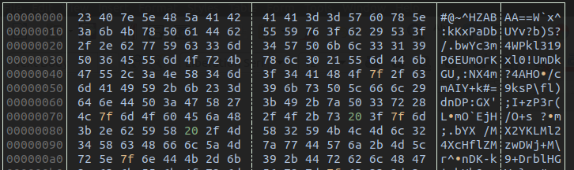{width="664"
height="197"}my.jpg.vft.enc has a very high entropy, there isn’t much we
can do with it. Let’s focus on the vbe file.

It’s giberish, but mostly ASCII printable characters.

Running the VBE file does nothing, there must be some environment checks
in it to ensure it will only execute on the victim’s machine.

This is a VBE file, an encoded VB script. Googling around for a decoder
will lead you to Didier Steven’s blog, where he shares a python script
for recovering the original VBS file


<https://blog.didierstevens.com/2016/03/29/decoding-vbe/>

Step 2 : VBS
------------

The resultig VBS file is minified, but not really obfuscated. Formatting
the code allows for a better understanding

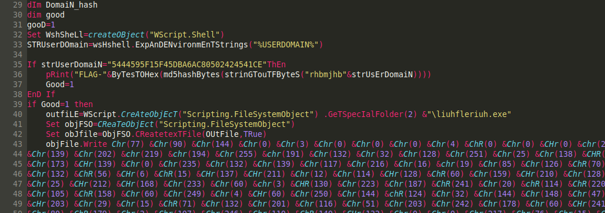{width="664" height="235"}

First of all, there is a flag being computed here on line 36 :

```python
"FLAG-" + MD5("rhbmjhb" + “5444595F15F45DBA6AC80502424541CE")
```

The code will only run on a very specific domain, this is why nothing
happened at first.

We can also see a large byte array being created at line 43. The first
two bytes, (77, 90) decode to “MZ” : This is a windows PE (exe) file.

To rebuild it, we can format the numbers and write a little bit a python
to conver the ints to

```python
data = bytes(int(x) for x in
Path('bytes.txt').read_text().splitlines())
Path('payload.bin').write_bytes(data)
```

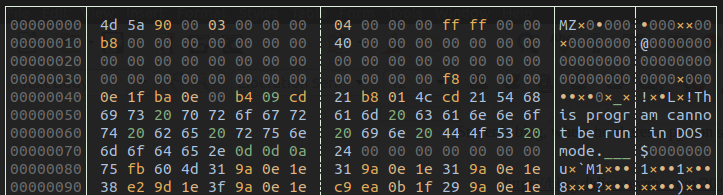{width="664" height="179"}
 A windows PE file

VFT Crypter : Part 2 ( The Packer)
==================================

Step 1: Understanding the packer
--------------------------------

Preliminary static analysis on the malware reveals nothing. The file is
probably packed. Running it does nothing as well, as there are still
more anti analysis features that prevent execution outside of the
victim’s environment.

We can use PE studio to look at the file structure.

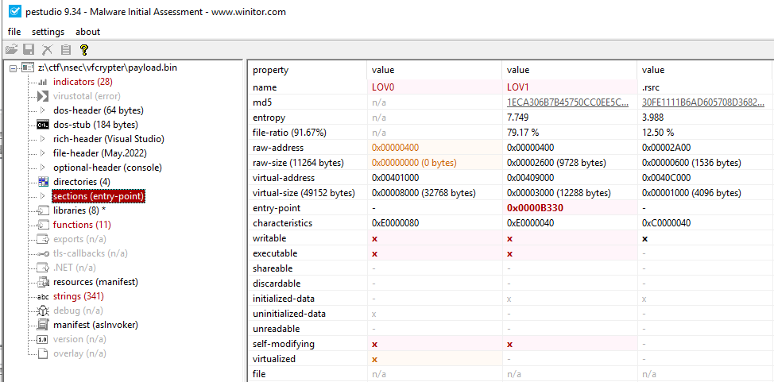{width="617" height="304"}

There are some anomalies : there is no .TEXT section, and we see the
non-standard .LOV0 and .LOV1 section names. This is very reminiscent of
upx packer’s sections UPX0 and UPX1.

We can confirm UPX by the indicator view in PE studio :

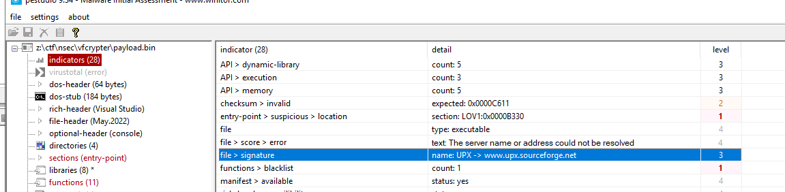{width="617" height="151"}

Step 2: Unpacking
-----------------

UPX is not meant as a malware packer, and can be easily unpacked
statically using the UPX executable. However, it’s not that easy here.
Since we are dealing with a modified version, unpaking fails\

We could rename the sections so that they match the original UPX
sections names and hope for the best, but we don’t know the extent of
the changes. Instead, let’s take the dynamic road here.

We’ll use a tried and true method for unpacking UPX using x64dbg. I
won’t go into too much details, since it’s been described many time.
Here’s the overview :

1.  Find the end of the UPX code, where the malware has fully unpacked.
2.  Place a breakpoint htere
3.  dump the memory
4.  use Scylla to reconstruct the import address table.

An in depth walkthrough can be found here :
<https://infosecwriteups.com/how-to-unpack-upx-packed-malware-with-a-single-breakpoint-4d3a23e21332>

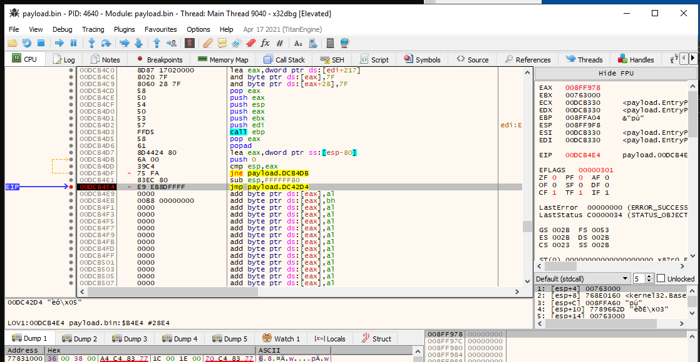{width="664" height="344"} The far jump at the end of the UPX code. After this jump, we’re in the unpacked code!

Step 3: A flag!
---------------

Since we have now dumped an unpacked malware, we can load it in ghidra
and start analyzing.

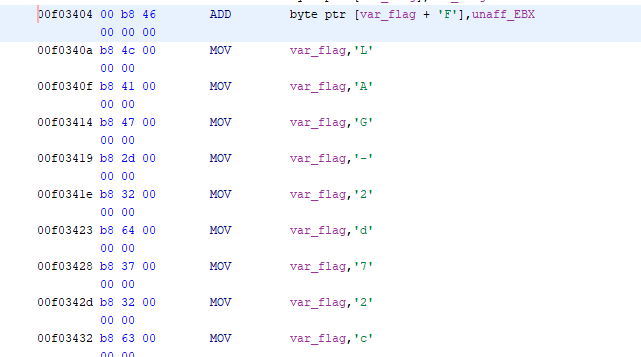{width="641" height="357"}We quickly find a flag getting written to memory byte by byte

VFT Crypter : Part 3 ( The payload)
===================================

Program Behavior
----------------

The program does a file system walk, looking for files matching
`*.vft` If these are found, it will encrypt them.

Two anti-analysis techniques are found in here, API Hashing, and
environment detection.

Anti analysis : API hashing
---------------------------

Every call to a windows API in the program is obfuscated with API
hashing. This is quite annoying, but worse, is that the hashing and API
resolution is done inline, making simple functions look very complex

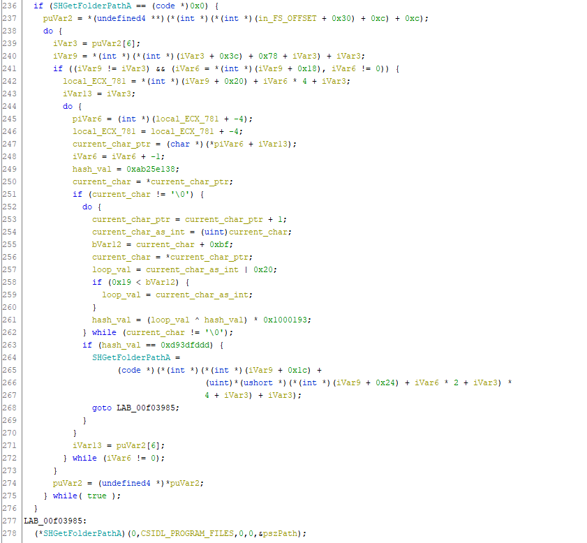{width="664" height="614"}A single call to SHGetFolderPathA

The API hashing algorithm is quite simple, but because each hash is
computed with a different seed value, automating the lookups is
annoying. For a faster analysis, a dynamic approach was used during the
CTF.

```python
#!/usr/bin/env python3

INIT_VAL =  0xab25e138                  # init hash value, hardcoded
API_STR = b'SHGetFolderPathA'           # API to test the hash of

hash_val = INIT_VAL
for i,b in enumerate(API_STR.lower()):
    hash_val = (b ^ hash_val) & 0xFFFFFFFF
    hash_val = (hash_val * 0x1000193) & 0xFFFFFFFF

print(hex(hash_val))                    # prints 0xd93dfddd
```

Anti analysis : Environment detection.
--------------------------------------

### Username Check

First, the username must be `rtavolo`. We can see here the call to StrStrA
that checks that `rtavolo` is within the user’s home path string

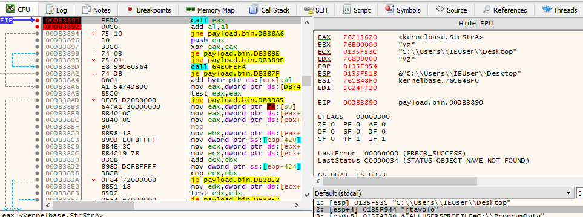{width="664" height="247"}

We can defeat this by putting a breakpoint after the call and altering
the vale of EAX to 1. Alternatively, we can patch the call with a `MOV EAX, 1`

Note that since we’re running the packed executable, we can’t set this
breakpoint when we’re at the entry point, we must run until we hit the
original entry point before setting it.

### Analysis Tool Detection

The function that walks the file system searching for ai `*.vft` file has
another use : every filepath encountered is compared against a series of
strings that would be found in an analysis environement (like, say, a
flare VM like mine.)

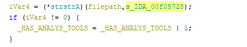{width="414" height="78"}

If any of the following strings are found, the `_HAS_ANALYSIS_TOOLS` var
won’t be zero, and the program will shutdown.

```
IDA
x64d
x32d
rohi
d4d
die.
ghid
peid
ssql
```

Once again, this can be defeated by modifying the execution flow. Here
we set the ZF to 1, to ensure the conditional jump is not taken

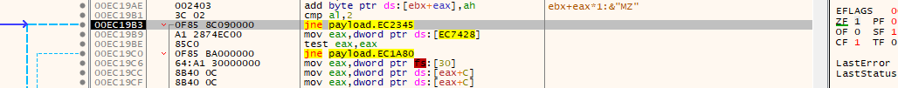{width="664" height="65"}

Crypto
------

At last we get to the meat of the problem : the crypto algorithm.
Unfortunately, the crypto scheme is not standard, it will need to be
reversed

Since we can encrypt arbitrary files at this point, we played a bit with
the program and let it encrypt various crafted plain texts

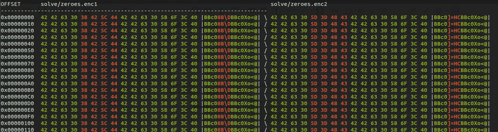{width="664" height="177"}The same file, consisting of only \\x00 encrypted twice.  The use of random bytes is obvious 
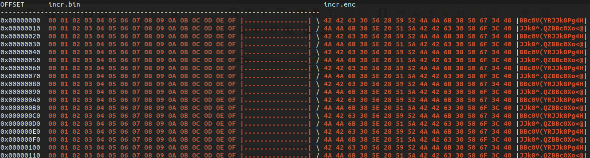{width="664" height="178"}Plaintext on the left, ciphertext on the right. there’s more to this than a simple xor, though we can see that repeating data
gives a repeating pattern

Let’s look at the encryption algorithm

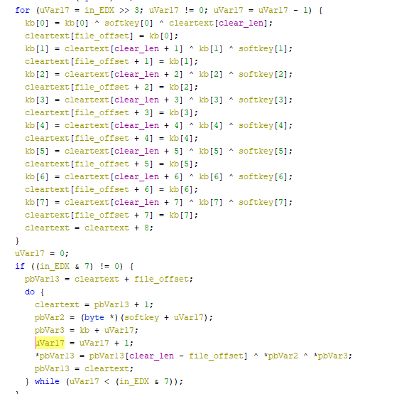{width="569" height="554"}The crypt loop

The sample has a hardcoded key that gets populated at `0x0f01238`. It
generates an 8 byte key from the the first 4 bytes of clear text,
concatenated with 4 random bytes (not shown). Both keys are used in a
simple xor ciphers, but with a twist : every byte of encrypted
ciphertext is used to replace a byte of the hard coded key.

Here’s the code to decrypt the jpeg and gain the flag

```python
#!/usr/bin/env python3
from pathlib import Path
from hexdump import hexdump


HARD_KEY =  bytearray.fromhex('42 42 63 30 58 6F 3C 40 30 03 2F 63 04 10 35 5C' )
CIPHER_FILE = Path('../chal/my.jpg.vft.enc')
JPEG_HEADER = bytes.fromhex('ff d8 ff e0 00 10 4a 46') # first 8 bytes of a known JPEG

ciphertext = CIPHER_FILE.read_bytes()
cleartext = bytearray(len(ciphertext))

# first, recover the random bytes. we can get them by xoring
# the Hard coded key, the ciphertext, and the bytes expected
# in the cleartext, all at offset 4->8
rand_bytes = bytes(a^b^c for a,b,c in zip(HARD_KEY[4:8],
                                          JPEG_HEADER[4:8],
                                          ciphertext[4:8]))

# then make the generated key with the first four bytes of
# the expected cleartext
generated_key = bytearray(JPEG_HEADER[0:4] + rand_bytes)


for i, b in enumerate(ciphertext):
    # get the key_byte by combining the generated key and the hard key
    kb = HARD_KEY[i%8]  ^ generated_key[i%8]

    # decrypt a byte of the cleartext
    cleartext[i] = kb ^ ciphertext[i]

    # update the hard_key with the newly decrypted byte
    HARD_KEY[i%8] = kb  ^ cleartext[i]

hexdump(cleartext[:256])


Path('out.jpg').write_bytes(cleartext)
```

{width="436"
height="667"}Success!
